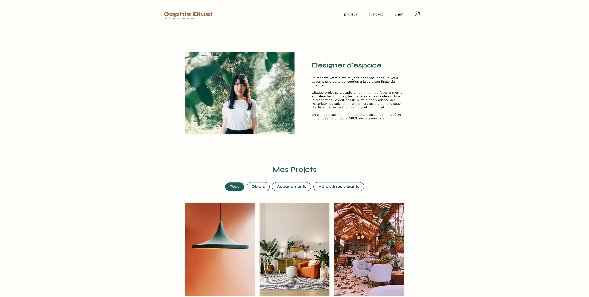
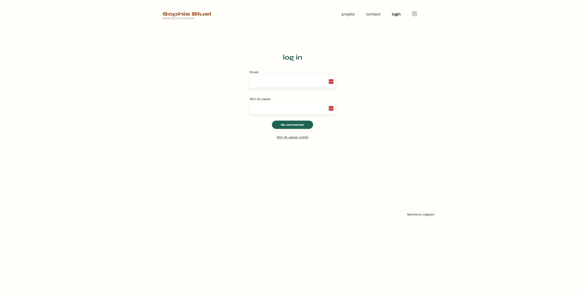
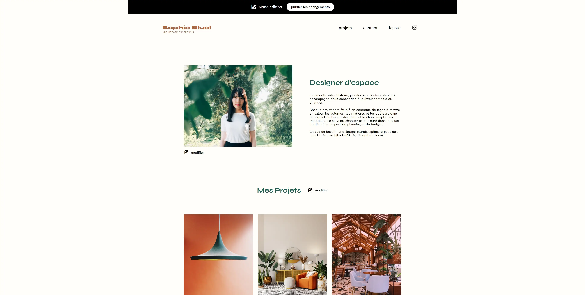
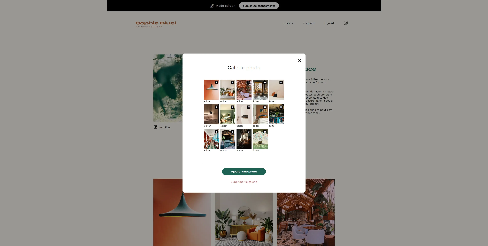

# PhotoFolio - Professional Photographer Portfolio

A dynamic web portfolio developed for showcasing the work of a professional photographer. This project encompasses a secure login screen with authentication, an image upload modal, and real-time updates to project presentation pages. Leveraging JavaScript, HTTP requests (GET, POST, DELETE), and asynchronous coding, PhotoFolio delivers an engaging user experience for both visitors and the admin.

## Table of Contents

- [Description](#description)
- [Installation](#installation)
- [Screenshots](#screenshots)
- [Usage](#usage)
- [Technologies Used](#technologies-used)
- [Contact](#contact)

## Description

PhotoFolio is a dynamic web portfolio developed for a professional photographer. The project encompasses the following key features:

- Secure authentication and login screen for admin access.
- Modal feature for uploading images with intuitive user experience.
- Real-time updates to project presentation pages for a seamless portfolio experience.
- Asynchronous coding for improved performance and responsiveness.
- Implementation of dropdown menus for easy navigation.

## Installation

1. Clone the repository: `git clone https://github.com/Arkodarkk/Professional_Photographer_Portfolio.git`
2. Navigate to the project directory: `cd Professional_Photographer_Portfolio`
3. Install dependencies: `npm install`

## Screenshots

## Usage

1. **Backend (Server)**:
   - Navigate to the backend directory: `cd Backend`
   - Install backend dependencies: `npm install`
   - Run the backend server: `npm start`

2. **Frontend (Site web)**:
   - Navigate to the frontend directory: `cd Frontend`
   - If not already installed, install live-server: `npm install -g live-server`
   - Start the frontend live server: `live-server`

3. **Login**
   To login and see the admin panel and use the modal to interact with the pictures here the details :
   - email: sophie.bluel@test.tld
   - password: S0phie 

## Technologies Used

- HTML
- CSS
- JavaScript
- HTTP Requests (GET, POST, DELETE)

## Contact

If you have any questions, suggestions, or feedback, feel free to contact me:

- Email: codecrushcontact@gmail.com
- GitHub: [Arkodarkk](https://github.com/Arkodarkk)